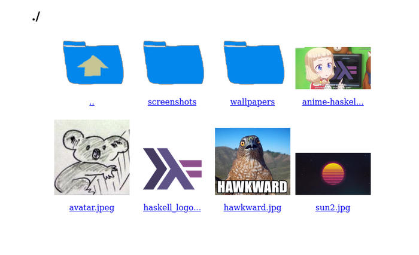

# imgs

A minimalistic image album file server

## Example



## Build & Run

Prerequisites: [Stack](https://haskellstack.org).

```sh
stack build && stack exec imgs
```

Will run the website on port 8080.

## Static executable

Uncomment the relevant lines in the `imgs.cabal` and `stack.yaml` files to build with ghc-musl and docker
